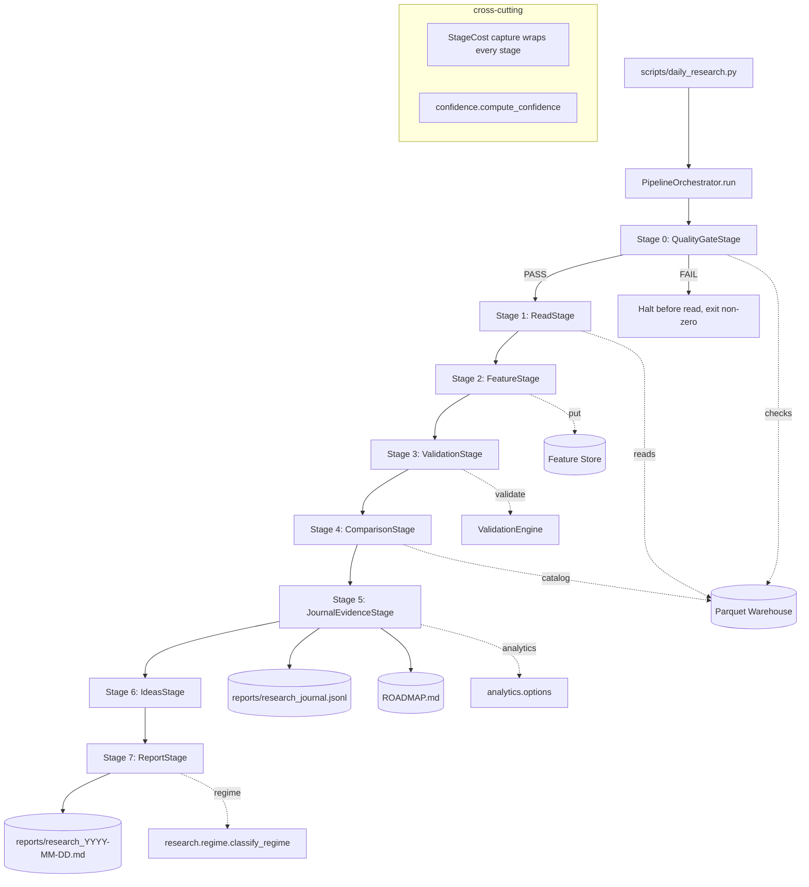
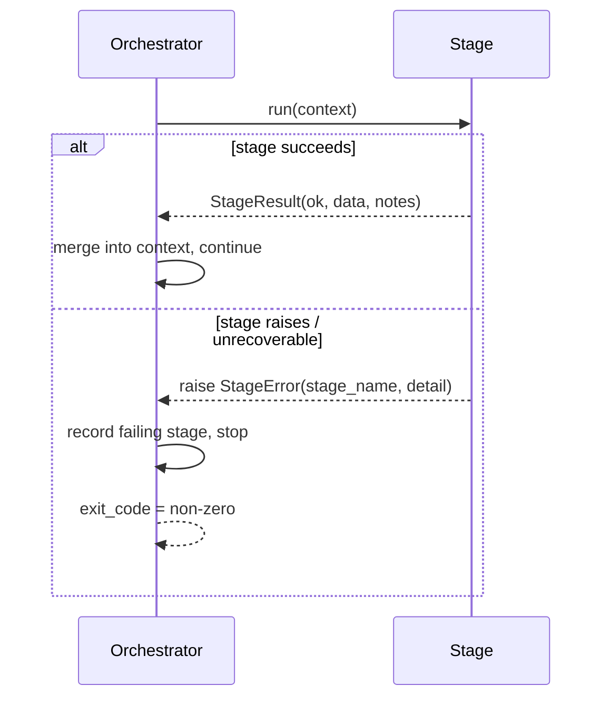

# Design Document

## Overview

The Daily Research Pipeline is a single evening command (`python scripts/daily_research.py`) that turns a trading day's collected option-chain and candle data into a concise, durable research report and maintains an evidence-based research journal. It is read-only analysis: it never places, modifies, or simulates a trade.

The design is an **orchestration layer** over the frozen `nifty_quant` v0.2 components. It introduces no new architecture and modifies no existing interface. New code lives in:

- `scripts/daily_research.py` — the thin CLI entry point (argument parsing, wiring, exit codes).
- `nifty_quant/research/pipeline/` — a new sub-package holding the orchestrator and the per-stage logic that is pure and unit-testable with synthetic data.

The pipeline is a **staged pipeline** that begins with a pre-flight data-quality gate and only then performs research:
`quality-gate → read → features → validation → comparison → evidence → ideas → report`.
Each stage is an independently testable function that takes explicit inputs and returns explicit outputs (no hidden global state). Stage failures are caught at the orchestration boundary, recorded with the failing stage name, and surfaced as a non-zero exit code. The **Data Quality Gate runs first** (Req 19): if it returns a FAIL verdict, the orchestrator halts *before* the read stage and exits non-zero, so no research is ever built on broken input data.

Every run also captures two cross-cutting summaries that frame the report: a **Market Regime** classification (Req 20, reusing the existing `nifty_quant.research.regime` classifier) rendered as the report's first section, and a single deterministic **Overall Research Confidence Score** (Req 21). Per-stage **computational cost** (time, memory, rows) is captured for every stage and rendered in the report (Req 22).

Two cross-cutting principles drive the design:

1. **Honest small-sample behavior.** Option-chain history is forward-collected and cannot be backfilled. Every comparison and unusual-event statement is computed only over the sessions actually collected and is annotated with that count. Below a configured minimum sample size, the pipeline explicitly refuses to claim statistical significance.
2. **Research, not trading, and deterministic by default.** AI-generated ideas are **disabled by default**: the primary hypothesis source is the deterministic `RuleBasedIdeaGenerator` feeding the research journal, evidence, and manual review (Req 15.1). With the AI enhancement disabled the pipeline is fully deterministic. The optional, opt-in AI enhancement only supplements the rule-based ideas with additional research ideas/explanations and falls back to rule-based generation on any failure.

### Reused frozen components (interfaces NOT modified)

| Concern | Component | Used interface |
|---|---|---|
| Warehouse reads | `nifty_quant.data.storage.ParquetStorage` / `Storage` | `read_option_chains(underlying, start, end)`, `read_candles(symbol, timeframe, start, end)` |
| Session metadata | `nifty_quant.data.session` | `session_metadata(...)` fields surfaced in `OptionChain.context` |
| Data models | `nifty_quant.data.models` | `OptionChain`, `OptionQuote`, `OHLCVSeries`, `Candle` |
| Feature computation | `nifty_quant.features.engine.FeatureEngine` | `on_option_chain(event)`, `on_candle(event) -> FeatureVector`, `.version` |
| Feature persistence | `nifty_quant.features.store.ParquetFeatureStore` / `FeatureStore` | `put(fv)`, `get(...)`, `to_frame(...)` |
| Option analytics | `nifty_quant.analytics.options` | `put_call_ratio`, `max_pain`, `atm_iv`, `gamma_exposure` |
| Validation/drift | `nifty_quant.validation.engine.ValidationEngine` | `validate(...)` → `ValidationReport`/`Alert` |
| Hypothesis store | `nifty_quant.research.journal.ResearchJournal` | `list()`, `add(...)`, `update(id, **fields)` |
| Market regime | `nifty_quant.research.regime` | `classify_regime(prices, config) -> Regime`, `Regime(trend, volatility, tags, stats)` |

The pipeline reuses the existing regime classifier (`classify_regime`, returning a frozen `Regime` with `trend` in `{UP, DOWN, SIDEWAYS}`, `volatility` in `{HIGH, LOW}`, and `tags`/`stats`). The daily pipeline adds only a thin adapter that supplies the Target_Session price series and augments the regime view with the option-derived gamma sign and PCR level it already computes — it does **not** reimplement regime classification (Req 20.3).

## Architecture

### High-level flow



Each stage is wrapped by a timing/memory recorder that emits a `StageCost` (Req 22). The `Research_Confidence_Score` is computed after validation/evidence are known and rendered alongside the report sections (Req 21).

### Orchestration and error handling

The orchestrator runs stages in a fixed order, beginning with the Data Quality Gate. Each stage produces a typed result object that is threaded into the next stage via a shared, accumulating `PipelineContext`. Every stage is invoked through a cost-capturing wrapper that records a `StageCost` (execution time, peak memory, rows processed) into `PipelineContext.stage_costs` regardless of stage outcome (Req 22). The orchestrator distinguishes two failure classes:

- **Quality gate FAIL** (Req 19.4): a distinguished unrecoverable condition. When `QualityGateStage` returns a FAIL verdict, the orchestrator halts **before** the read stage, records every failing `QualityCheckResult`, sets `failing_stage="quality_gate"`, and returns a non-zero exit code. No read, feature, or downstream work runs.
- **Unrecoverable error** (e.g., no option-chain data for the Target_Session, an exception escaping a stage): the orchestrator records `failing_stage` and the error detail, writes nothing further, and returns a non-zero exit code.
- **Recoverable condition** (e.g., validation insufficient-data, a single uncomputable metric, AI unavailable): the stage records an informational note and continues; the run still exits 0.



### Determinism strategy

Determinism (Requirement 17) is achieved by: (a) reusing the deterministic `FeatureEngine` and analytics, (b) ordering all reads/iterations by `session_id`/timestamp, (c) using only integer/decimal Evidence_Score arithmetic with fixed configured constants, and (d) gating all non-determinism (AI calls, wall-clock timestamps used in logic) out of the computation path. The `Research_Confidence_Score` (Req 21) and `Quality_Score` (Req 19) are pure integer functions of their inputs and are therefore deterministic across identical runs (Req 21.4). The per-stage `StageCost` time/memory values are inherently non-deterministic instrumentation, so they are recorded for human analysis only and **never** feed back into any score, verdict, or section content. The report records a generation timestamp for human reference only; it never feeds back into Evidence_Score or section content.

## Components and Interfaces

### CLI entry point — `scripts/daily_research.py`

```python
def main() -> int:
    """Parse args, build PipelineConfig, run orchestrator, return exit code."""
```

Arguments (all optional, deterministic defaults):

- `--session YYYY-MM-DD` — explicit Target_Session (Req 1.3). Default: most recent collected session (Req 1.2).
- `--underlying NIFTY`, `--timeframe 5m`
- `--data-dir data`, `--feature-dir data`, `--report-dir reports`
- `--journal reports/research_journal.jsonl`, `--roadmap ROADMAP.md`
- `--ai / --no-ai` (default `--no-ai`; rule-based is the primary, deterministic source) (Req 15.1)
- `--min-sample N` (default 20) — minimum sessions before significance language is allowed (Req 9.4, 14.x)
- `--quality-threshold N` (default 70) — minimum Quality_Score for a PASS verdict (Req 19.3)

`main` returns `0` on success, non-zero on unrecoverable failure; `scripts/daily_research.py` calls `sys.exit(main())`.

### Orchestrator — `nifty_quant/research/pipeline/orchestrator.py`

```python
@dataclass
class PipelineConfig:
    underlying: str = "NIFTY"
    timeframe: str = "5m"
    data_dir: str = "data"
    feature_dir: str = "data"
    report_dir: str = "reports"
    journal_path: str = "reports/research_journal.jsonl"
    roadmap_path: str = "ROADMAP.md"
    session: date | None = None
    use_ai: bool = False  # AI disabled by default; rule-based is primary (Req 15.1)
    evidence: EvidenceConfig = EvidenceConfig()
    min_sample_size: int = 20
    quality: "QualityConfig" = QualityConfig()      # data-quality gate thresholds (Req 19)
    confidence: "ConfidenceConfig" = ConfidenceConfig()  # confidence-score weights (Req 21)

@dataclass
class PipelineResult:
    target_session: date
    collected_session_count: int
    report_path: Path
    exit_code: int
    failing_stage: str | None
    error_detail: str | None
    quality_score: int | None          # Quality_Score for the run (Req 19.5)
    confidence_score: int | None       # Research_Confidence_Score (Req 21.1)
    stage_costs: list["StageCost"]     # per-stage computational cost (Req 22.2)

class PipelineOrchestrator:
    def __init__(self, config: PipelineConfig,
                 storage: Storage,
                 feature_store: FeatureStore,
                 journal: ResearchJournal,
                 idea_generator: "IdeaGenerator"): ...

    def run(self) -> PipelineResult: ...
```

Dependencies are injected (storage, feature store, journal, idea generator) so tests can substitute in-memory/synthetic implementations (Req 17.2, 17.3).

### Stage interfaces — `nifty_quant/research/pipeline/stages.py`

Each stage is a pure-ish function operating on explicit inputs so it is independently testable (Req 17.3). Stage order matches the orchestration flow (quality gate first):

```python
def quality_gate_stage(storage, underlying, timeframe, target, config) -> QualityResult
def read_stage(storage, underlying, timeframe, target, prior_window) -> ReadResult
def feature_stage(feature_engine, feature_store, read_result) -> FeatureResult
def validation_stage(validation_engine, feature_result, history) -> ValidationResult
def comparison_stage(catalog, market_summary, history, min_sample) -> ComparisonResult
def journal_evidence_stage(journal, evidence_engine, market_summary, history) -> JournalResult
def ideas_stage(idea_generator, summary, comparison, history) -> IdeasResult
def report_stage(renderer, *results) -> Path
```

Every stage call is routed through a cost-capturing wrapper:

```python
def run_with_cost(stage_name: str, fn, *args, **kwargs) -> tuple[Any, StageCost]:
    """Invoke fn, measuring elapsed time, peak memory (tracemalloc), and
    rows processed (reported by the stage); return result + StageCost (Req 22)."""
```

#### Stage 0 — Data Quality Gate (Requirement 19)

Runs **before** the read stage and before any research computation begins (Req 19.1). It reads the Target_Session option chains and candles through the existing `Storage` interface (no new backend) and runs a fixed battery of `Quality_Check` functions, each returning a `QualityCheckResult`:

| Quality_Check | Detects | Method |
|---|---|---|
| `check_api_outage` | API-outage / missing candles | expected vs actual candle count for the session window; long gaps between consecutive candle timestamps |
| `check_duplicate_timestamps` | duplicate timestamps | repeated `snapshot_ts` (chains) or candle `ts` within the session |
| `check_expiry_mismatch` | expiry mismatch | `context["days_to_expiry"]`/`is_expiry_day` inconsistent with the chain's expiry vs session date |
| `check_holiday` | holiday / non-trading day | session date not a trading day, or zero snapshots on a weekday |
| `check_timezone_anomaly` | timezone anomaly | timestamps outside the expected exchange session window / non-IST offset |

Each check contributes a weighted penalty; `quality.py` aggregates them into a `Quality_Score` in 0..100 and a PASS/FAIL verdict (`PASS` iff `score >= config.quality.pass_threshold` and no check is marked `blocking`). On **FAIL** the stage raises `StageError("quality_gate", ...)` carrying the failing checks; the orchestrator halts before read and exits non-zero (Req 19.4). On **PASS** the `Quality_Score` is threaded forward and rendered in the report (Req 19.5) and is one input to the confidence score (Req 21.2).

#### Stage 1 — Read (Requirements 2, 16.1)

Uses `storage.read_option_chains(underlying, start, end)` and `storage.read_candles(symbol, timeframe, start, end)` for the Target_Session day window `[00:00, 23:59:59]`. A `SessionCatalog` (below) enumerates available sessions by reading option chains over a broad window and grouping by `snapshot_ts.date()` — this uses only the existing `Storage` interface (no new backend, Req 2.5/16.1). If the Target_Session has zero snapshots, the stage raises `StageError("read", "no option-chain data for <session>")` → non-zero exit (Req 2.3). `OptionChain.context` (carrying `india_vix`, `days_to_expiry`, `minutes_since_open`, `is_expiry_day`) is preserved unchanged for downstream stages (Req 2.4).

The stage selects a **representative end-of-day snapshot** (the latest `snapshot_ts` of the Target_Session) for single-snapshot analytics, while keeping the full ordered list for intraday metrics.

#### Stage 2 — Features (Requirements 3, 16.2)

Replays the session's events through a `FeatureEngine`: for each `OptionChain`, call `on_option_chain(OptionChainEvent(...))`; for each `Candle`, call `on_candle(CandleEvent(...))` and collect the emitted `FeatureVector`. Each vector is persisted with `feature_store.put(fv)`. Because `FeatureEngine` is deterministic and `ParquetFeatureStore.put` de-duplicates on `(version, symbol, day, timestamp)` keeping last, re-running the stage for the same session yields identical stored values (Req 3.4, 17.1). The `FeatureVector.version` (from `FeatureEngine.version`) is persisted with each row, so incompatible feature sets are never mixed (Req 3.3). Option-derived features come exclusively from the analytics module via the engine (Req 3.5/16.3).

#### Stage 3 — Validation (Requirements 4, 16.4)

Builds a `Baseline` whose `feature_distributions` are drawn from prior-session feature values and calls `ValidationEngine.validate(...)` with the Target_Session feature arrays as `current_features`. Because the daily pipeline has no live equity/trades, the trade-based checks defer with the engine's `insufficient_data` INFO alert, which is surfaced as an informational note rather than a failure (Req 4.3). All emitted `Alert` levels and messages are captured for the report (Req 4.2). No drift/health logic is reimplemented (Req 4.4).

#### Stage 4 — Comparison (Requirements 5, 9, 14)

Computes `Collected_Session_Count` from the `SessionCatalog`, builds per-session metric series over the Prior_Sessions actually collected, detects unusual events (extremity + gamma flip), and annotates every statement with the session count when below `min_sample_size`.

#### Stage 5 — Journal & Evidence (Requirements 7, 8, 11, 12, 18.2, 23)

Loads hypotheses via `journal.list()`, evaluates each against the Target_Session metrics + history through the `EvidenceEngine` (below), updates Evidence_Score and status, and persists every change via `journal.update(id, ...)`. New rule-based trackable ideas are added with `journal.add(..., status="open")` (Req 12.3). Status is always constrained to `{open, testing, supported, rejected, inconclusive}` (Req 12.4). Status changes to `supported`/`rejected` trigger a `ROADMAP.md` update (Req 18.2). This stage also writes/refreshes the expanded **Experiment_Record** provenance (Req 23) encoded through the existing journal fields/tags (see Experiment Registry below).

#### Stage 6 — Ideas (Requirements 10, 15)

Generates `ResearchIdea`s from the comparison/evidence results via the injected `IdeaGenerator` (rule-based by default; AI opt-in with fallback), estimates each idea's `Expected_Information_Gain`, ranks them descending by that estimate, and assigns `Priority` 1..N in ranked order (Req 10.3, 10.4).

#### Stage 7 — Report (Requirements 6, 13, 19.5, 20, 21, 22.3)

Renders a single self-contained markdown file `reports/research_<session>.md` (overwriting any existing file for that session) opening with the Market Regime section and the Overall Research Confidence Score, followed by the five required sections, the Quality_Score, and the per-stage computational-cost table (Req 13.1–13.4, 19.5, 20.1, 21.1, 22.3).

### SessionCatalog — `nifty_quant/research/pipeline/catalog.py`

```python
class SessionCatalog:
    def __init__(self, storage, underlying, timeframe): ...
    def sessions_up_to(self, target: date) -> list[date]:
        """Distinct collected session dates ≤ target, ascending."""
    def collected_count(self, target: date) -> int:
    def prior_sessions(self, target: date) -> list[date]:
```

Implemented by reading option chains over `[epoch, target_end]` once and grouping by date. Uses only `Storage.read_option_chains` (Req 2.5, 16.1).

### EvidenceEngine — `nifty_quant/research/pipeline/evidence.py`

The Evidence_Score is **persisted inside the existing `Hypothesis` record** (no separate store, Req 12.5) using a structured tag `evidence:<NN>` plus a mirrored `confidence = NN/100` for readability. The engine encodes/decodes the score from the hypothesis, so the journal remains the single source of truth (Req 11.7).

```python
@dataclass
class EvidenceConfig:
    support_increment: int = 10
    contradict_decrement: int = 15
    decay_per_session: int = 5
    support_threshold: int = 80   # >= => supported
    reject_threshold: int = 20    # <= => rejected
    initial_score: int = 50

class Verdict(Enum):
    SUPPORTING = "supporting"
    CONTRADICTING = "contradicting"
    ABSENT = "absent"   # no evidence this session => decay

class EvidenceEngine:
    def __init__(self, config: EvidenceConfig): ...

    def read_score(self, h: Hypothesis) -> int:
        """Decode evidence:<NN> tag; default to config.initial_score."""

    def apply(self, score: int, verdict: Verdict) -> int:
        """Pure update, clamped to [0, 100]."""

    def next_status(self, score: int, current: str) -> str:
        """Map score to status using thresholds; valid set only."""

    def evaluate(self, h: Hypothesis, summary: MarketSummary,
                 history: list[SessionMetrics]) -> Verdict:
        """Deterministic rule mapping a hypothesis (by tags) to a verdict."""
```

`apply` is the core pure function:

- `SUPPORTING` → `min(100, score + support_increment)`
- `CONTRADICTING` → `max(0, score - contradict_decrement)`
- `ABSENT` → `max(0, score - decay_per_session)`

`next_status`: `score <= reject_threshold → "rejected"`; `score >= support_threshold → "supported"`; otherwise the hypothesis stays in its current non-terminal status (or `testing` once it has received evidence).

### QualityGate — `nifty_quant/research/pipeline/quality.py`

Pure data-quality logic, separated from I/O so it is fully unit-testable with synthetic snapshots (Req 17.3, 19).

```python
@dataclass(frozen=True)
class QualityConfig:
    pass_threshold: int = 70          # PASS iff score >= threshold and no blocking check fails
    expected_candles: int | None = None   # None => infer from timeframe + session window
    max_gap_minutes: int = 15         # gap above this flags API outage / missing candles
    exchange_tz: str = "Asia/Kolkata"
    # per-check penalty weights (sum need not be 100; score is normalised)
    weights: dict[str, int] = field(default_factory=lambda: {
        "api_outage": 35, "duplicate_timestamps": 15, "expiry_mismatch": 20,
        "holiday": 20, "timezone_anomaly": 10,
    })
    blocking: frozenset[str] = frozenset({"api_outage", "holiday"})

@dataclass(frozen=True)
class QualityCheckResult:
    name: str                 # e.g. "duplicate_timestamps"
    passed: bool
    penalty: int              # 0 when passed; weighted penalty when failed
    detail: str               # human-readable explanation of what was detected
    blocking: bool            # if True, a failure forces an overall FAIL verdict

@dataclass(frozen=True)
class QualityReport:
    session_id: str
    score: int                # Quality_Score, clamped to 0..100
    verdict: str              # "PASS" | "FAIL"
    checks: list[QualityCheckResult]

    @property
    def failing_checks(self) -> list[QualityCheckResult]:
        return [c for c in self.checks if not c.passed]

def run_quality_checks(chains, candles, session, config) -> list[QualityCheckResult]: ...

def score_quality(checks: list[QualityCheckResult], config: QualityConfig) -> QualityReport:
    """Pure aggregation: score = clamp(100 - sum(penalties), 0, 100);
    verdict = PASS iff score >= pass_threshold and no blocking check failed."""
```

Each `Quality_Check` (`check_api_outage`, `check_duplicate_timestamps`, `check_expiry_mismatch`, `check_holiday`, `check_timezone_anomaly`) inspects the Target_Session inputs and returns a `QualityCheckResult`. `score_quality` is the pure scoring function whose output bounds and verdict mapping are covered by correctness properties.

### ConfidenceScorer — `nifty_quant/research/pipeline/confidence.py`

A single deterministic, pure function computes the `Research_Confidence_Score` (Req 21) by combining five normalised factors, each in 0..100, via fixed configured weights.

```python
@dataclass(frozen=True)
class ConfidenceConfig:
    # weights sum to 100; score is the weighted average, rounded to int
    w_data_quality: int = 30      # from Quality_Score
    w_sample_size: int = 20       # from Collected_Session_Count vs min_sample_size
    w_feature_drift: int = 20     # inverse of validation drift severity
    w_validation: int = 15        # inverse of validation alert severity
    w_evidence_maturity: int = 15 # from spread/age of Evidence_Scores

@dataclass(frozen=True)
class ConfidenceBreakdown:
    """Per-factor contributions shown in the report (Req 21.3)."""
    data_quality: int
    sample_size: int
    feature_drift: int
    validation: int
    evidence_maturity: int

@dataclass(frozen=True)
class ConfidenceResult:
    score: int                       # Research_Confidence_Score, 0..100
    breakdown: ConfidenceBreakdown
    factors: list[tuple[str, int, int]]  # (factor_name, factor_value, weight) for rendering

def compute_confidence(
    quality_score: int,
    collected_session_count: int,
    min_sample_size: int,
    drift_severity: float,
    alert_severity: float,
    evidence_maturity: float,
    config: ConfidenceConfig,
) -> ConfidenceResult:
    """Pure, deterministic weighted average of the five factors, clamped to 0..100."""
```

Because every input is a deterministic value already computed earlier in the run, the score is reproducible across identical runs (Req 21.4) and never consumes wall-clock time or memory cost.

### Market regime adapter — `nifty_quant/research/pipeline/regime_view.py`

A thin adapter that reuses the frozen `nifty_quant.research.regime.classify_regime` (Req 20.3) and enriches it with the option-derived signals the pipeline already computes:

```python
def market_regime(candle_history: "pd.Series",
                  summary: MarketSummary,
                  config: RegimeConfig | None = None) -> MarketRegime:
    """Reuse classify_regime for trend/volatility; map gamma_sign -> gamma regime
    and pcr -> PCR level. Any classification that cannot be computed is recorded
    as None so the renderer marks it 'unavailable' (Req 20.4)."""
```

It performs **no** regime math of its own beyond labelling the gamma sign (`bullish`/`neutral`/`bearish`) and PCR level (`low`/`neutral`/`high`); trend and volatility come straight from `classify_regime`.

### StageCost capture — `nifty_quant/research/pipeline/cost.py`

```python
@dataclass(frozen=True)
class StageCost:
    stage_name: str
    elapsed_seconds: float    # wall-clock execution time (Req 22.1)
    peak_memory_bytes: int    # via tracemalloc around the stage
    rows_processed: int       # reported by the stage (snapshots/candles/rows)
```

`run_with_cost` (in the orchestrator) wraps every stage, appending one `StageCost` per executed stage to `PipelineContext.stage_costs` so the metrics are retained for the run (Req 22.2) and rendered in the report (Req 22.3). These values are excluded from all deterministic computations.

### IdeaGenerator (rule-based + optional AI) — `nifty_quant/research/pipeline/ideas.py`

```python
class IdeaGenerator(Protocol):
    def generate(self, summary, comparison, history) -> list[ResearchIdea]: ...

class RuleBasedIdeaGenerator:  # deterministic, PRIMARY/default source (Req 15.1)
    ...

class AIIdeaGenerator:         # optional, opt-in wrapper only (Req 15.3)
    def __init__(self, backend, fallback: RuleBasedIdeaGenerator): ...
    def generate(self, *a, **k) -> list[ResearchIdea]:
        try: ... # call backend, sanitize, then SUPPLEMENT rule-based ideas
        except Exception: return self.fallback.generate(*a, **k)  # Req 15.4

def estimate_information_gain(idea: ResearchIdea, comparison, history) -> float:
    """Deterministic Expected_Information_Gain estimate: higher for patterns that
    are rarer (more surprising), better-sampled, and tied to unresolved hypotheses."""

def prioritize(ideas: list[ResearchIdea]) -> list[ResearchIdea]:
    """Sort ideas by descending Expected_Information_Gain (stable on ties) and
    assign Priority = 1..N in that order; Priority 1 is the highest gain (Req 10.3, 10.4)."""
```

The **rule-based generator is the primary, default hypothesis source**; the AI enhancement is disabled by default (`PipelineConfig.use_ai = False`, Req 15.1) and, when explicitly enabled, only *supplements* the rule-based ideas. After generation, all ideas are scored by `estimate_information_gain` and ordered by `prioritize`, which assigns the `Priority` label (Req 10.3, 10.4). All ideas pass through a `sanitize_idea` function that strips/raises on trade-recommendation phrasing, guaranteeing research-only output for both rule-based and AI paths (Req 10.6, 15.4).

### ReportRenderer — `nifty_quant/research/pipeline/report.py`

Pure function `render(report_model: DailyReportModel) -> str` producing markdown. The report opens with the **Market Regime** section (Req 20.1) and the **Overall Research Confidence Score** with its contributing factors (Req 21.1, 21.3), followed by the five required headed sections, the **Quality_Score** (Req 19.5), and a **Computational Cost** table listing each stage's time/memory/rows (Req 22.3). Writing is a thin `write(path, text)` so rendering is testable without I/O.

### RoadmapWriter — `nifty_quant/research/pipeline/roadmap.py`

Maintains the single `ROADMAP.md` control center at the repository root (Req 18.4). On each run it rewrites the document from current journal + warehouse + quality state. The expanded control center renders these sections (Req 18.1):

- **Architecture Version** and **Frozen Components** (static, from config).
- **Current Dataset** plus inventory counts: **Collected Sessions**, **Collected Option Chains**, **Collected Trading Days** — sourced from the `SessionCatalog` (Req 18.3).
- **Data Quality** — the latest run's `Quality_Score` and verdict (Req 18.3).
- **Open Hypotheses**, **Supported Hypotheses**, **Rejected Hypotheses** — partitioned from current journal state; updated whenever a status changes to `supported`/`rejected` during a run (Req 18.2).
- **Top Performing Experiments** — hypotheses ranked by Evidence_Score (highest first).
- **Research Priorities** — the prioritized `ResearchIdea` list (Priority 1..N).
- **Next Milestones** — static/config-driven roadmap items.

```python
class RoadmapWriter:
    def render(self, model: "RoadmapModel") -> str: ...   # pure, testable
    def write(self, path: str, text: str) -> None: ...
```

The hypothesis lists form a strict three-way partition (every non-terminal hypothesis under Open, every `supported` under Supported, every `rejected` under Rejected), which is covered by a correctness property.

## Data Models

New models are plain dataclasses (mirroring the existing codebase style) defined in `nifty_quant/research/pipeline/models.py`.

```python
@dataclass(frozen=True)
class SessionMetrics:
    """Per-session headline metrics used for comparison/unusual events."""
    session_id: str            # ISO date
    nifty_pct_change: float | None
    india_vix: float | None
    india_vix_pct_change: float | None
    pcr: float | None
    max_pain: float | None
    gamma_sign: int | None     # -1, 0, +1 (sign of total_gex)
    total_gex: float | None
    oi_change: float | None
    atm_iv: float | None

@dataclass(frozen=True)
class MarketSummary:
    """Target_Session metrics for report Section 1 (Req 6)."""
    session_id: str
    metrics: SessionMetrics
    unavailable: list[str]     # names of metrics that could not be computed

@dataclass(frozen=True)
class EvidenceChange:
    hypothesis_id: int
    text: str
    prior_score: int
    updated_score: int
    verdict: Verdict
    observation: str           # what supported/contradicted (Req 7.3)
    status_before: str
    status_after: str

@dataclass(frozen=True)
class UnusualEvent:
    metric: str
    description: str           # e.g. "largest IV expansion in 18 sessions"
    sessions_spanned: int
    significant: bool          # False while below min_sample_size (Req 9.4/14.3)

@dataclass(frozen=True)
class ResearchIdea:
    text: str                  # phrased as an investigation (Req 10.6)
    occurrence_count: int | None
    total_sessions: int
    information_gain: float = 0.0   # Expected_Information_Gain estimate (Req 10.3)
    priority: int | None = None     # 1..N, assigned after ranking; 1 = highest gain (Req 10.4)

@dataclass(frozen=True)
class MarketRegime:
    """Report Section 0 classification (Req 20). Any field None => render 'unavailable'."""
    trend: str | None          # "UP" | "DOWN" | "SIDEWAYS" (from classify_regime)
    volatility: str | None     # "HIGH" | "LOW" (from classify_regime)
    gamma_regime: str | None   # "bullish" | "neutral" | "bearish" (from gamma sign)
    pcr_level: str | None      # "low" | "neutral" | "high"

@dataclass(frozen=True)
class ExperimentRecord:
    """Expanded provenance for a unit of research work (Req 23), encoded into the
    existing Hypothesis via structured tags/fields — no separate store (Req 23.2)."""
    research_question: str
    hypothesis: str
    dataset_version: str
    feature_version: str
    code_version: str
    result: str
    decision: str
    next_action: str

@dataclass(frozen=True)
class ComparisonResult:
    collected_session_count: int
    prior_session_count: int
    unusual_events: list[UnusualEvent]
    min_sample_size: int
    history_available: bool    # False when target is the only session (Req 5.4)

@dataclass(frozen=True)
class DailyReportModel:
    """Everything needed to render the report (regime first, then the five sections)."""
    target_session: str
    market_regime: MarketRegime          # Section 0, rendered first (Req 20.1)
    confidence: ConfidenceResult         # Overall Research Confidence Score (Req 21)
    quality: QualityReport               # Quality_Score + verdict (Req 19.5)
    market_summary: MarketSummary
    gained: list[EvidenceChange]
    weakened: list[EvidenceChange]
    rejected: list[EvidenceChange]
    unusual_events: list[UnusualEvent]
    ideas: list[ResearchIdea]            # prioritized, descending information gain (Req 10.3)
    validation_notes: list[str]
    comparison: ComparisonResult
    stage_costs: list[StageCost]         # per-stage computational cost (Req 22.3)
```

### Evidence_Score persistence model

The score lives on the existing `Hypothesis` via tags. Example journal record after a run:

```json
{"id": 3, "timestamp": "...", "hypothesis": "High PCR precedes mean reversion",
 "status": "testing", "confidence": 0.65, "reason": "PCR>1.3 with positive next-day drift",
 "tags": ["pcr", "evidence:65"]}
```

Decode rule: the first tag matching `^evidence:(\d{1,3})$` is the score; absent → `EvidenceConfig.initial_score`. Encode rule: on update, replace any existing `evidence:*` tag with `evidence:<NN>` and set `confidence = NN/100`. This round-trips losslessly through `ResearchJournal.add`/`update`/`list` without modifying the frozen interface.

### Experiment_Record persistence model (Requirement 23)

The expanded experiment provenance is stored **inside the existing `Hypothesis`** with no new store (Req 23.2). The eight `ExperimentRecord` fields map onto the existing journal fields plus structured tags that survive `add`/`update`/`list` unchanged:

| ExperimentRecord field | Encoding on `Hypothesis` |
|---|---|
| `research_question` | tag `exp.rq:<base64url>` |
| `hypothesis` | `Hypothesis.hypothesis` (native field) |
| `dataset_version` | tag `exp.dataset:<value>` |
| `feature_version` | tag `exp.feature:<value>` |
| `code_version` | tag `exp.code:<value>` |
| `result` | tag `exp.result:<base64url>` |
| `decision` | tag `exp.decision:<value>` |
| `next_action` | tag `exp.next:<base64url>` |

Free-text fields (research question, result, next action) are base64url-encoded so they tolerate spaces/colons inside the tag-list encoding; short identifier fields are stored verbatim. `experiment.py` (within the pipeline package) provides pure `encode_experiment(record) -> (hypothesis_text, tags)` and `decode_experiment(h: Hypothesis) -> ExperimentRecord` helpers. Because encoding is total and decoding is its inverse, the record round-trips through `ResearchJournal.add`/`update`/`list` (Req 23.3), which a correctness property verifies.

### Metric computation rules (Requirement 6)

| Metric | Source | "Unavailable" when |
|---|---|---|
| NIFTY % change | candles: `(last_close - prior_session_close)/prior_session_close`, fallback intraday `(close-open)/open` | no candles for session |
| India VIX % change | `context["india_vix"]` target vs prior session | `india_vix` absent in context |
| PCR | `analytics.put_call_ratio(eod_chain, by="oi")` | NaN / no quotes |
| Max pain | `analytics.max_pain(eod_chain)` | chain has no strikes |
| Gamma sign | `sign(analytics.gamma_exposure(eod_chain).total_gex)` | analytics raises |
| OI change | `sum(q.oi_change for q in eod_chain.quotes)` | no quotes |

Any metric that cannot be computed is added to `MarketSummary.unavailable` and rendered as `unavailable` rather than omitted (Req 6.5).

## Correctness Properties

*A property is a characteristic or behavior that should hold true across all valid executions of a system — essentially, a formal statement about what the system should do. Properties serve as the bridge between human-readable specifications and machine-verifiable correctness guarantees.*

The following properties were derived from the acceptance-criteria prework. Architectural constraints (reuse of frozen components including the regime classifier, read-only operation, single-file roadmap location), one-off behaviors (fixed stage order with the quality gate first, explicit-session selection, specific error paths), and non-deterministic instrumentation (per-stage time/memory measurement) are covered by example/smoke/edge tests in the Testing Strategy rather than by properties.

### Property 1: Evidence_Score stays within bounds

*For any* initial Evidence_Score in 0..100 and *any* finite sequence of verdicts (`SUPPORTING`, `CONTRADICTING`, `ABSENT`), every intermediate and final score produced by `EvidenceEngine.apply` is an integer in the inclusive range 0..100.

**Validates: Requirements 11.1, 11.2, 11.3**

### Property 2: Evidence_Score moves in the correct direction

*For any* Evidence_Score `s` in 0..100: `apply(s, SUPPORTING) >= s`, `apply(s, CONTRADICTING) <= s`, and `apply(s, ABSENT) <= s`; and repeatedly applying `ABSENT` is non-increasing and converges to 0 (decay toward rejection).

**Validates: Requirements 11.2, 11.3, 11.4**

### Property 3: Status mapping is valid and respects thresholds

*For any* Evidence_Score `s` in 0..100 and *any* current status, `next_status(s, current)` returns a value in `{open, testing, supported, rejected, inconclusive}`; it returns `rejected` whenever `s <= reject_threshold` and `supported` whenever `s >= support_threshold`.

**Validates: Requirements 11.5, 11.6, 12.4**

### Property 4: Evidence_Score and journal fields round-trip through persistence

*For any* hypothesis and *any* Evidence_Score, status, and reason written via `ResearchJournal.update` (with the score encoded in the `evidence:<NN>` tag), reloading the journal via `ResearchJournal.list` decodes the identical score and reflects the identical status and reason.

**Validates: Requirements 11.7, 12.2**

### Property 5: Determinism with AI disabled

*For any* fixed synthetic warehouse, fixed journal state, and the AI enhancement disabled, two independent pipeline runs produce identical Evidence_Score updates and identical Daily_Research_Report content.

**Validates: Requirements 15.1, 17.1**

### Property 6: Generated research ideas are never trade recommendations

*For any* inputs to idea generation (rule-based, or AI output passed through `sanitize_idea`, including adversarial AI text), every produced `ResearchIdea` is phrased as an investigation and contains no trade-recommendation phrasing (e.g., buy, sell, enter, exit, go long, go short, take a position).

**Validates: Requirements 10.6, 15.4**

### Property 7: AI failure falls back to the rule-based result

*For any* AI backend that is unavailable or raises an error, the `AIIdeaGenerator` output equals the `RuleBasedIdeaGenerator` output for the same inputs, and the run completes successfully.

**Validates: Requirements 15.4**

### Property 8: Collected_Session_Count and comparison window reflect only collected sessions

*For any* set of collected session dates and *any* Target_Session, `Collected_Session_Count` equals the number of distinct collected sessions at or before the target, and every comparison uses a window no larger than the number of Prior_Sessions actually collected (no backfill assumed).

**Validates: Requirements 5.1, 5.2**

### Property 9: Extreme Target_Session metric produces an unusual event with the correct span

*For any* per-session metric series in which the Target_Session value is the strict maximum (or strict minimum) among collected sessions, the comparison stage records an `UnusualEvent` that names the metric and states the number of sessions spanned equal to the count of sessions considered.

**Validates: Requirements 9.2**

### Property 10: Gamma flip is recorded exactly when the gamma sign changes

*For any* pair of (prior session gamma sign, Target_Session gamma sign), a gamma-flip `UnusualEvent` is recorded if and only if the two signs differ.

**Validates: Requirements 9.3**

### Property 11: Below the minimum sample size, every comparison statement is count-annotated and claims no significance

*For any* output produced when `Collected_Session_Count` is below `min_sample_size`, every comparison and unusual-event statement is annotated with the actual number of sessions used, and no statement is marked significant or uses statistical-significance language.

**Validates: Requirements 5.3, 9.4, 14.2, 14.3, 10.3**

### Property 12: Graceful small-sample completion

*For any* `Collected_Session_Count` in 1..5, the pipeline completes all stages and produces a Daily_Research_Report; and *for any* metric whose required window exceeds the available Prior_Sessions, the metric is reported over the available sessions without raising.

**Validates: Requirements 14.1, 14.4**

### Property 13: Snapshot context is preserved through the read stage

*For any* `OptionChain` carrying a `context` dict (including fields such as `india_vix`, `days_to_expiry`, `minutes_since_open`, `is_expiry_day`), the read stage exposes those fields downstream unchanged.

**Validates: Requirements 2.4**

### Property 14: Feature refresh is idempotent

*For any* synthetic Target_Session, running the feature stage twice persists identical stored feature values (same versioned rows), so a re-run reproduces the same feature set.

**Validates: Requirements 3.4**

### Property 15: The report contains the regime section, confidence score, and all five sections

*For any* `DailyReportModel`, the rendered report contains the Market Regime section as the first section, the Overall Research Confidence Score, the Quality_Score, and all five required section headers ("What happened today", "Hypotheses that gained evidence", "Hypotheses that weakened", "Unusual events", "What to investigate tomorrow") in a single self-contained artifact.

**Validates: Requirements 6.1, 7.1, 8.1, 9.1, 10.1, 13.4, 19.5, 20.1, 21.1**

### Property 16: Unavailable market metrics are marked, never omitted

*For any* `MarketSummary` in which a subset of metrics is unavailable, the rendered "What happened today" section lists every such metric marked as unavailable rather than silently dropping it.

**Validates: Requirements 6.5**

### Property 17: Evidence-change sections render prior and updated scores

*For any* set of `EvidenceChange` records, every hypothesis whose score increased appears in the "gained evidence" section with both its prior and updated score and its supporting observation; every hypothesis whose score decreased appears in the "weakened" section with both scores; and every hypothesis whose status became `rejected` is listed as rejected with its reason.

**Validates: Requirements 7.2, 7.3, 8.2, 8.3**

### Property 18: Report filename identifies the Target_Session

*For any* Target_Session date, the written report filename contains that session's ISO date.

**Validates: Requirements 13.2**

### Property 19: Roadmap hypothesis lists partition by status

*For any* set of hypotheses with assorted statuses, the rendered `ROADMAP.md` lists exactly the non-terminal hypotheses under Open Hypotheses, exactly the `supported` hypotheses under Supported Hypotheses, and exactly the `rejected` hypotheses under Rejected Hypotheses — a complete three-way partition reflecting the current journal state.

**Validates: Requirements 18.2**

### Property 20: Quality_Score is bounded and the verdict respects the threshold

*For any* set of `QualityCheckResult`s, `score_quality` returns a `Quality_Score` that is an integer in the inclusive range 0..100, and a verdict of `PASS` if and only if the score is at or above the configured `pass_threshold` and no blocking check failed (otherwise `FAIL`).

**Validates: Requirements 19.3**

### Property 21: Each injected data defect is detected and reported by its Quality_Check

*For any* synthetic Target_Session into which exactly one known defect class (missing candles/API outage, duplicate timestamps, expiry mismatch, holiday/non-trading day, or timezone anomaly) is injected, the corresponding `Quality_Check` fails and its `QualityCheckResult.detail` describes the detected defect; and *for any* clean synthetic session, no check fails.

**Validates: Requirements 19.2, 19.4**

### Property 22: A FAIL verdict halts the pipeline before the read stage

*For any* Target_Session inputs that produce a FAIL verdict, the orchestrator does not invoke the read stage or any later stage, every failing `Quality_Check` appears in the reported output, and the run exits with a non-zero status code.

**Validates: Requirements 19.1, 19.4**

### Property 23: Research_Confidence_Score is bounded, deterministic, and shows its factors

*For any* combination of the five input factors (data quality, sample size, feature drift, validation alerts, evidence maturity), `compute_confidence` returns a `Research_Confidence_Score` that is an integer in the inclusive range 0..100, returns the identical result when invoked again with the same inputs, and produces a `ConfidenceBreakdown`/`factors` list that includes every contributing factor.

**Validates: Requirements 21.1, 21.2, 21.3, 21.4**

### Property 24: Research ideas are ranked by descending Expected_Information_Gain

*For any* set of two or more `ResearchIdea`s, `prioritize` returns them ordered so that `information_gain` is non-increasing, assigns `priority` values 1..N with no gaps or duplicates in ranked order, and the idea with the maximum Expected_Information_Gain is assigned Priority 1.

**Validates: Requirements 10.3, 10.4**

### Property 25: Per-stage computational cost is captured for every stage and rendered

*For any* sequence of executed stages, exactly one `StageCost` (carrying execution time, memory usage, and rows processed) is captured per executed stage, and *for any* `DailyReportModel`, the rendered report includes every captured stage's cost metrics.

**Validates: Requirements 22.2, 22.3**

### Property 26: Experiment_Record round-trips through the journal

*For any* `ExperimentRecord` field values, encoding the record onto a `Hypothesis`, persisting it via the existing `ResearchJournal` (`add`/`update`), reloading via `list`, and decoding recovers the identical Research Question, Hypothesis, Dataset Version, Feature Version, Code Version, Result, Decision, and Next Action.

**Validates: Requirements 23.1, 23.3**

### Property 27: Market regime renders its classification, marking unavailable fields

*For any* `MarketRegime`, the rendered Market Regime section states the trend, volatility, gamma regime, and PCR level; any field that could not be computed (None) is shown marked as unavailable rather than omitted.

**Validates: Requirements 20.2, 20.4**

## Error Handling

### Failure classification

| Condition | Stage | Class | Behavior |
|---|---|---|---|
| Data Quality Gate FAIL verdict | Quality Gate | Unrecoverable | Halt **before** read, record every failing `Quality_Check`, `failing_stage="quality_gate"`, exit non-zero (Req 19.4) |
| No option-chain data for Target_Session | Read | Unrecoverable | Record `failing_stage="read"` + detail, exit non-zero (Req 2.3, 1.5) |
| Warehouse read raises (corrupt/missing partition) | Read | Unrecoverable | Catch at orchestrator, record stage + detail, exit non-zero (Req 1.5) |
| A single market-summary metric uncomputable | Report | Recoverable | Mark metric unavailable, continue, exit 0 (Req 6.5) |
| Validation insufficient-data | Validation | Recoverable | Record informational note, continue (Req 4.3) |
| AI backend unavailable / raises | Ideas | Recoverable | Fall back to rule-based, continue (Req 15.4) |
| No research idea derivable | Ideas | Recoverable | Render "no research ideas generated" (Req 10.5) |
| Feature/analytics raise on a sparse chain | Features | Recoverable | Engine already guards with try/except; feature omitted |

### Orchestrator contract

- Stages raise `StageError(stage_name, detail)` for unrecoverable failures; the orchestrator catches it, populates `PipelineResult.failing_stage`/`error_detail`, prints the failing stage and detail to stderr, and returns a non-zero exit code (Req 1.5).
- All recoverable conditions are accumulated as `notes` on the relevant `StageResult` and surfaced in the report; they never change the exit code (success remains 0, Req 1.4).
- The orchestrator never partially writes the journal: Evidence_Score updates are computed in memory and only flushed through `ResearchJournal.update` once the journal/evidence stage completes, so an unrecoverable failure in a later stage does not corrupt hypothesis state.

### Exit codes

- `0` — all stages completed (recoverable notes allowed).
- `1` — unrecoverable error in a stage (detail and failing stage reported).
- `2` — invalid CLI arguments (e.g., malformed `--session`).

## Testing Strategy

### Dual approach

- **Property-based tests** verify the universal properties above across many generated inputs.
- **Example / edge / smoke tests** verify specific behaviors, error paths, and architectural constraints that are not universally quantified.

### Property-based testing

PBT **is appropriate** for this feature: the Evidence_Score arithmetic, status mapping, small-sample annotation, unusual-event detection, data-quality scoring/detection, confidence scoring, idea prioritization, report/roadmap rendering, and journal/experiment round-trips are pure functions with large, meaningful input spaces.

- **Library:** [`hypothesis`](https://hypothesis.readthedocs.io/) (the standard Python PBT library). Add `hypothesis>=6` to the `dev` optional-dependencies in `pyproject.toml`. Property-based testing is **not** implemented from scratch.
- **Iterations:** each property test runs a minimum of 100 examples (`@settings(max_examples=100)`).
- **Tagging:** each property test carries a comment referencing its design property in the form
  `# Feature: daily-research-pipeline, Property N: <property text>`.
- **One test per property:** each of Properties 1–27 is implemented by a single property-based test.
- **Generators (synthetic data):** custom Hypothesis strategies build `OptionChain`/`OptionQuote`/`Candle` snapshots (clean and with one injected defect class for the quality gate), per-session metric series, `EvidenceChange`/`UnusualEvent`/`ResearchIdea` lists (with information-gain values), `QualityCheckResult` sets, confidence factor tuples, `MarketRegime` values (with missing fields), `StageCost` lists, `ExperimentRecord` field values, and `Hypothesis` records (with `evidence:<NN>` and `exp.*` tags). No live market access is required (Req 17.2). Generators deliberately include edge cases: empty/whitespace context, non-ASCII strings, single-session histories, scores at the 0/100 boundaries, ties in information gain, all-failing/all-passing quality checks, and adversarial AI idea text.

### Example, edge, and smoke tests

- **Examples:** quality gate runs before read (Req 19.1); PASS proceeds to read and Quality_Score in report (Req 19.5); fixed stage order (Req 1.1); explicit-session selection (Req 1.3); happy-path exit 0 (Req 1.4); read interfaces used (Req 2.1, 2.2); features computed/persisted with version (Req 3.1–3.3); validation invoked (Req 4.1); section content for known inputs (Req 6.2–6.4); at-least-one idea for a known pattern (Req 10.2); AI off by default with rule-based primary (Req 15.1) and AI backend used when explicitly enabled and available (Req 15.2, 15.3); journal load/add (Req 12.1, 12.3); per-stage `StageCost` populated with time/memory/rows (Req 22.1); Experiment_Record captures all eight fields (Req 23.1); report written under `reports/` (Req 13.1); expanded roadmap content incl. arch version, frozen components, dataset/counts, data quality, top experiments, priorities, milestones + root location (Req 18.1, 18.3, 18.4).
- **Edge cases:** quality gate FAIL halts before read (Req 19.4); unrecoverable stage error path (Req 1.5); no option data (Req 2.3); insufficient-data note (Req 4.3); single-session warehouse (Req 5.4); regime classification unavailable (Req 20.4); empty gained/weakened/unusual/ideas messages (Req 7.4, 8.4, 9.5, 10.7); report overwrite idempotence (Req 13.3).
- **Smoke / architectural:** read-only — pipeline package imports no broker/order modules (Req 1.6); reuse of frozen `Storage`, `FeatureEngine`/`FeatureStore`, analytics, `ValidationEngine`, `ResearchJournal`, and the `nifty_quant.research.regime` classifier without modifying their interfaces (Req 2.5, 3.5, 4.4, 12.5, 16.1–16.6, 20.3); experiment provenance persisted only through the existing journal (Req 23.2); per-stage independent testability with synthetic inputs (Req 17.2, 17.3).

### Determinism verification

Property 5 doubles as the determinism guard: the full pipeline is run twice on identical synthetic inputs with AI disabled and the produced report text and Evidence_Score updates are asserted byte-for-byte equal.
